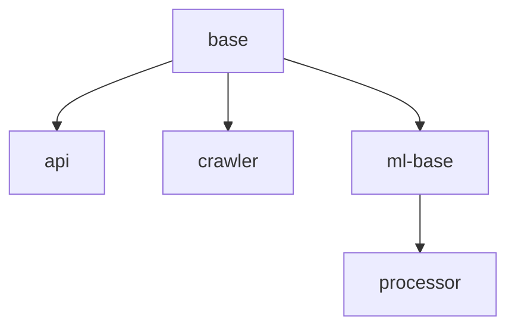

# GCP Service Deployment Scripts

## Overview

Two scripts for building and deploying services to Google Cloud Platform:

1. **`deploy-all-services.sh`** - Original sequential script (all services, fixed order)
2. **`deploy-services.sh`** - **NEW** Flexible script with service selection

## Quick Start

### Deploy CI Services Only (After Code Changes)
```bash
./scripts/deploy-services.sh fix/telemetrystring ci
```
Builds: API, Crawler, Processor (uses existing base images)

### Deploy Specific Services
```bash
./scripts/deploy-services.sh main crawler processor
```
Builds: Crawler and Processor only

### Deploy All Services (Full Rebuild)
```bash
./scripts/deploy-services.sh main all
```
Builds: base → ml-base → api + crawler (parallel) → processor

### Deploy from Current Branch
```bash
# Assumes you're on the right branch
./scripts/deploy-services.sh $(git branch --show-current) crawler processor api
```

## Service Options

| Service    | Description                           | Dependencies         | Build Time |
|------------|---------------------------------------|----------------------|------------|
| `base`     | Base image (Python, system packages)  | None                 | 2-3 min    |
| `ml`       | ML base (PyTorch, Transformers)       | base                 | 5-8 min    |
| `api`      | FastAPI backend service               | base                 | 30-60 sec  |
| `crawler`  | Discovery & extraction service        | base                 | 30-60 sec  |
| `processor`| ML processing service                 | ml                   | 30-60 sec  |
| `ci`       | Alias for: api + crawler + processor  | base/ml (existing)   | 2-3 min    |
| `all`      | All services in dependency order      | Sequential builds    | 8-12 min   |

## Dependency Flow



### Parallel Building
- API and Crawler build in **parallel** after base completes
- Processor waits for ML base to complete
- Saves ~1-2 minutes compared to sequential builds

## Usage Patterns

### After Source Code Changes
```bash
# Changed discovery.py, extraction.py → crawler + processor
./scripts/deploy-services.sh fix/telemetrystring crawler processor

# Changed API routes → api only
./scripts/deploy-services.sh main api

# Changed shared code → rebuild all CI services
./scripts/deploy-services.sh main ci
```

### After Dependency Updates
```bash
# Updated requirements-base.txt → rebuild everything
./scripts/deploy-services.sh main all

# Updated requirements-ml.txt → rebuild ml + processor
./scripts/deploy-services.sh main ml processor

# Updated requirements-api.txt → rebuild api only
./scripts/deploy-services.sh main api
```

### For PostgreSQL Migration (Current Use Case)
```bash
# Changes in src/crawler/discovery.py and src/cli/commands/
./scripts/deploy-services.sh fix/telemetrystring crawler processor api
```

## VS Code Integration

Three new tasks in `.vscode/tasks.json`:

1. **GCP: Deploy Services (CI Only)** - Prompts for branch, builds api+crawler+processor
2. **GCP: Deploy Services (Custom)** - Prompts for branch and services
3. **GCP: Deploy All Services** - Prompts for branch, builds everything

Access via: `Cmd+Shift+P` → "Tasks: Run Task"

## Safety Features

- ✅ Validates gcloud CLI availability
- ✅ Waits for each build to complete before dependent builds
- ✅ Detects build failures and aborts dependent builds
- ✅ Color-coded output for status visibility
- ✅ Returns exit code 1 if any builds fail
- ✅ Removes duplicate services from input
- ✅ Maintains correct dependency order
- ✅ Shows build IDs for log access

## Build Status Monitoring

```bash
# Get build ID from script output, then:
gcloud builds log <BUILD_ID>

# Or view in GCP Console:
# https://console.cloud.google.com/cloud-build/builds
```

## Troubleshooting

### Build Failures
```bash
# View recent builds
gcloud builds list --limit=5

# Get detailed logs
gcloud builds log <BUILD_ID>

# Check trigger configuration
gcloud builds triggers describe build-<service>-manual
```

### Dependency Issues
```bash
# If processor fails due to missing ML base:
./scripts/deploy-services.sh main ml processor

# If services fail due to missing base:
./scripts/deploy-services.sh main base api crawler
```

### Branch Not Found
```bash
# Verify branch exists in remote
git branch -r | grep <branch-name>

# Push branch if needed
git push -u origin <branch-name>
```

## Examples

### Current PostgreSQL Migration
```bash
# After fixing discovery.py and extraction.py:
./scripts/deploy-services.sh fix/telemetrystring crawler processor

# Or use the alias:
./scripts/deploy-services.sh fix/telemetrystring ci
```

### Production Release
```bash
# Full rebuild for new version:
./scripts/deploy-services.sh main all

# Or selective rebuild:
./scripts/deploy-services.sh main base ml processor
```

### Hotfix Deployment
```bash
# Quick API fix:
./scripts/deploy-services.sh hotfix/critical-bug api

# Crawler bug fix:
./scripts/deploy-services.sh hotfix/crawler-fix crawler
```

## Comparison: Old vs New Script

| Feature                    | deploy-all-services.sh | deploy-services.sh |
|----------------------------|------------------------|--------------------|
| Service selection          | ❌ All only            | ✅ Flexible        |
| Parallel builds            | ❌ Sequential          | ✅ api + crawler   |
| Skip base images           | ❌ Always builds       | ✅ Yes             |
| Dependency validation      | ✅ Yes                 | ✅ Yes             |
| Build failure handling     | ✅ Yes                 | ✅ Yes             |
| Estimated time (CI only)   | ~10 min                | ~2-3 min           |
| Estimated time (all)       | ~12 min                | ~8-10 min          |

## Best Practices

1. **Use `ci` alias for code changes** - Faster, uses existing base images
2. **Rebuild base only when dependencies change** - Saves time
3. **Monitor build logs for first deployment** - Catch issues early
4. **Use specific services when possible** - Faster iteration
5. **Test locally before deployment** - Run pytest, ruff, mypy first

## Related Files

- `cloudbuild-base.yaml` - Base image build config
- `cloudbuild-ml-base.yaml` - ML base image build config
- `cloudbuild-api.yaml` - API service build config
- `cloudbuild-crawler.yaml` - Crawler service build config
- `cloudbuild-processor.yaml` - Processor service build config
- `trigger-*.yaml` - Cloud Build trigger definitions
- `.vscode/tasks.json` - VS Code task integration
